# Ranitas · Pedidos 🐸

Sistema completo de pedidos para **Gorditas Ranitas** (Torreón, Coahuila): las familias arman su pedido desde el celular, el anfitrión lo manda en **un solo WhatsApp**, y el restaurante lo trabaja en vivo desde un admin con Mostrador, Cocina, Reparto, Mesas con QR, Productos, Precios, Usuarios y Bitácora. Todo sincronizado al instante entre todos los que lo tengan abierto. Se instala como app en celular y computadora.

> Este README está escrito para que Ricardo (o quien siga el proyecto) entienda en una lectura qué hay, dónde vive, cómo se despliega y qué falta. Última actualización: **5 de septiembre de 2026**.

---

## 1. Ligas y accesos

| Qué | Liga |
|---|---|
| App de familias (home) | https://ranita.capitaltorreon.com/ |
| Tablero de un anfitrión | `https://ranita.capitaltorreon.com/<liga>` · ejemplo real: https://ranita.capitaltorreon.com/familia-lopez-acosta |
| Admin del restaurante | https://ranita.capitaltorreon.com/admin |
| Manuales por perfil | https://ranita.capitaltorreon.com/manual |
| Hoja QR de una mesa (imprimible carta) | `https://ranita.capitaltorreon.com/mesa?s=mesa-<sucursal>-<n>` |
| Repositorio | https://github.com/ricardolopezreyero/pedidos |
| Cloudflare Pages (proyecto `ranita`) | https://ranita.pages.dev |
| Firebase Realtime Database (proyecto `notion-casa`) | https://console.firebase.google.com/project/notion-casa/database · ruta raíz `ranitas/` |
| Worker de SMS (pendiente de activar) | https://ranitas-sms.noisy-shape-4fc9.workers.dev/notify |

**Clave maestra del admin: `123`** (constante `CLAVE_MAESTRA` en `app/admin.html`). Entra a todo, incluida la vista Sucursales. Los demás usuarios se crean en Admin → Usuarios con su propia clave y las vistas que se les permiten.

Atajos por URL del admin:

| Parámetro | Efecto |
|---|---|
| `?k=123` | Entra sin teclear la clave (útil para tablets de cocina o caja). |
| `?v=pedidos` / `mostrador` / `cocina` / `reparto` / `mesas` / `productos` / `precios` / `usuarios` / `sucursales` / `bitacora` / `manual` | Abre esa vista. |
| `&suc=vinedos` | Sucursal preseleccionada (`sanatorio`, `vinedos`, `juarez`, `ibero`). |
| `&t=familia-lopez-acosta` | Pedidos filtrado a ese tablero. |
| `&coc=<id>` / `&rep=<id>` | Cocinero o repartidor preseleccionado en su vista. |
| `&ped=<tablero>/<id>` | Abre ese pedido en Mostrador. |
| `&demo=1` | Enciende el modo demo (datos ficticios con movimiento, nada se guarda). |
| `&demo=1&foto=1` | Demo sin el letrero rojo y sin movimiento, para capturas y videos. |

Ejemplo para una tablet de cocina en Viñedos: `https://ranita.capitaltorreon.com/admin?k=123&v=cocina&suc=vinedos`

---

## 2. Cómo funciona (el flujo completo)

```
Familia arma en su celular ──► Anfitrión manda WhatsApp ──► Cocina lo toma ──► Comal ──► Empaque ──► Reparto / Mesa / Mostrador ──► Entregado ──► Historial
   ✏️ Armando   📋 Por pedir        📲 Pedido            🍳 En proceso   🔥 Armando en cocina   ⏳ Espera · 🛵 Repartiendo   ✅       📚
```

Es **la misma tarjeta** en todos lados: lo que la familia teclea lo ve la caja al instante, lo que la cocina palomea lo ve la familia, y cuando el repartidor toca Entregado, todos lo ven. Las tarjetas se ordenan por turnos (la más antigua arriba, la nueva entra abajo) y se deslizan suavemente cuando cambian de columna.

### La app de familias (`app/index.html`)

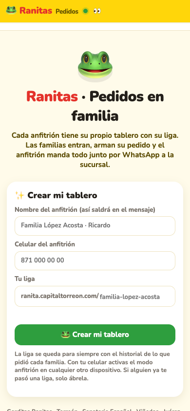

- **Home**: crear un tablero de anfitrión (liga permanente, ejemplo `/familia-lopez-acosta`) o entrar a los que ya tienes. Los tableros se recuerdan en el celular.
- **Tablero**: Kanban Armando → Por pedir → Pedido → Cocina → En camino → Entregado → Historial. Cada familia es una tarjeta; dentro, cada persona con sus gorditas (🌾 harina ámbar / 🌽 maíz azul), chilaquiles (salsa con su picor, queso, agregados), postres y bebidas.
- **Modo anfitrión**: se activa con el celular del anfitrión (`?host=<tel>`). Solo él manda el WhatsApp consolidado a la sucursal, ve quién está escribiendo, y recibe avisos cuando una familia da Listo.
- **Repetir pedido**: cualquier pedido del historial se clona con un toque.
- **Agotados**: si Productos apaga algo, sale en rojo y no deja mandar hasta ajustar. Si la cocina marca "no hubo" después de pedido, la familia ve el aviso.
- **Mesas**: una liga `mesa-<sucursal>-<n>` abre el tablero de esa mesa; el comensal ordena solo y la cocina lo recibe con prioridad.

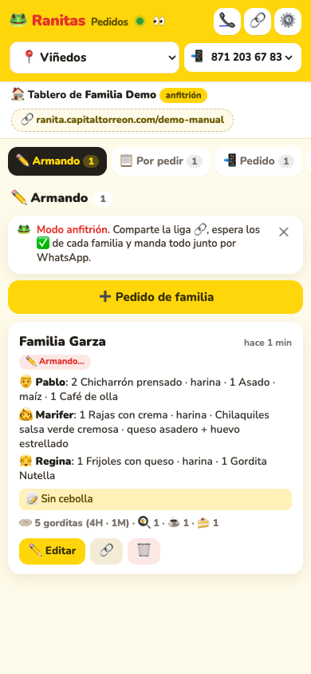 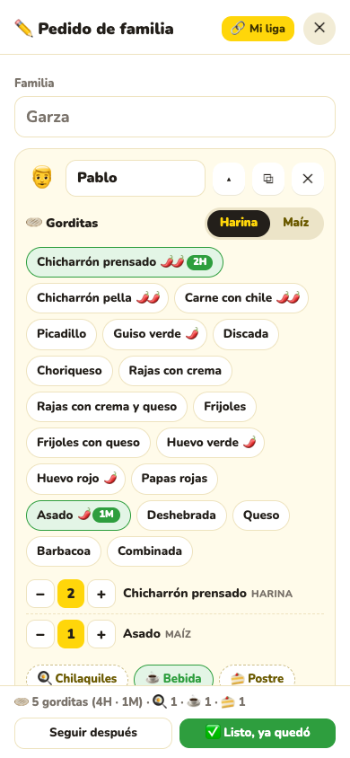

### El admin (`app/admin.html`)

| Vista | Para qué | Quién |
|---|---|---|
| 📊 **Panorama** | Data room: pedidos de hoy, gorditas por guiso y masa, tiempos de cocina y reparto, hora pico, historial de 14 días, línea de tiempo de un pedido. | Dueño |
| 📋 **Pedidos** | Kanban de todo el negocio con búsqueda, filtros por sucursal y tablero, etiquetas Pagado / Por entregar, botones para avanzar cada pedido, comanda imprimible 🖨, "Otra familia en este tablero" y barra del anfitrión con Llamar y WhatsApp. | Caja, dueño |
| 🧾 **Mostrador** | POS: pedidos en sucursal tecleando o dictando (🎤), varios pedidos abiertos a la vez, número secuencial, atajos a mesas con pedido, anfitriones con pedido (buscador) y reparto. Al editar el pedido de un anfitrión se ven todas sus familias y se puede agregar otra. | Caja |
| 🔥 **Cocina** | Cola con prioridad de mesa, "Lo tomo", paso 1 Comal (palomear guisos, "no hay" discreto), paso 2 Empaque (una bolsa por persona), demanda en tandas, pantalla completa. | Cocineros |
| 🛵 **Reparto** | La segunda cocina: listos para salir agrupados por colonia, el repartidor arma su viaje con varios pedidos, ruta completa en Maps, entrega parada por parada, cobra, "Regresa" si no estaba el cliente. | Repartidores |
| 🪑 **Mesas** | QR por mesa, hoja imprimible tamaño carta, pedidos activos, entregados hoy y en total. | Caja |
| 🏪 **Productos** | Prender / apagar por sucursal, por masa (🌾/🌽) y picor de guisos y salsas. | Caja, dueño |
| 💲 **Precios** | Tabla por sucursal, harina y maíz, copiar de otra sucursal. | Dueño |
| 👥 **Usuarios** | Claves y vistas permitidas por persona. | Dueño |
| 🏬 **Sucursales** | Alta de sucursal con todo automático (mesas, mostrador, catálogo, cocina). Solo Maestro. | Dueño |
| 📜 **Bitácora** | Registro permanente de absolutamente todo, en vivo, con filtros y búsqueda. | Dueño |
| 📖 **Manuales** | Manual por perfil con capturas y lenguaje simple. | Todos |

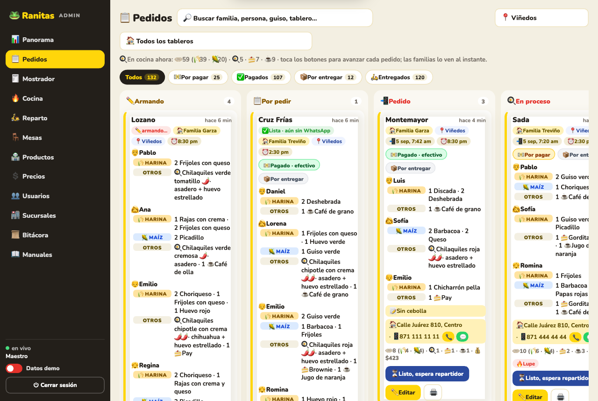
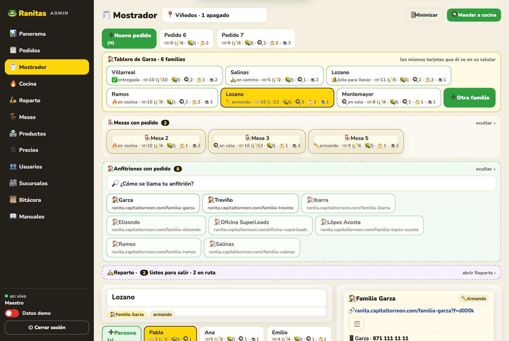
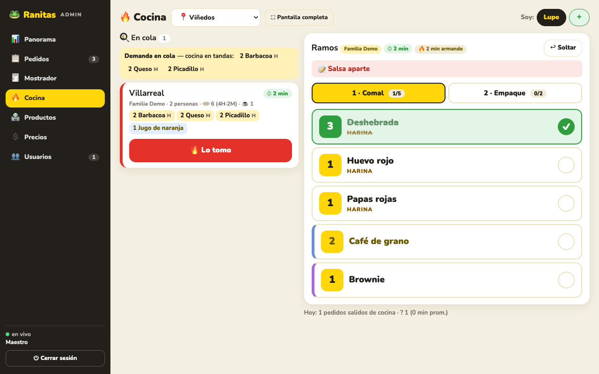
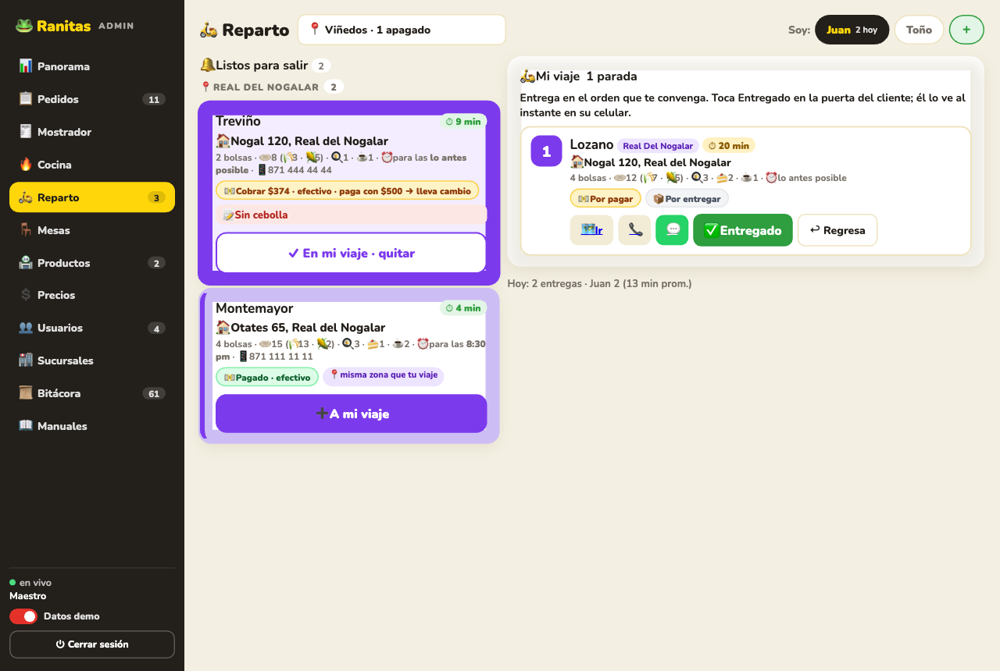
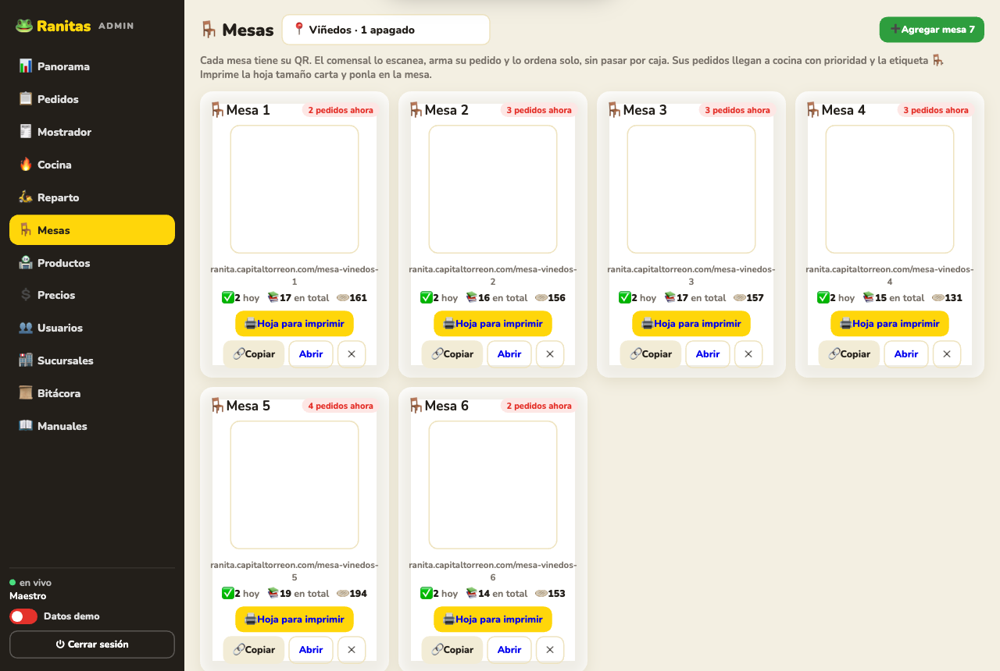
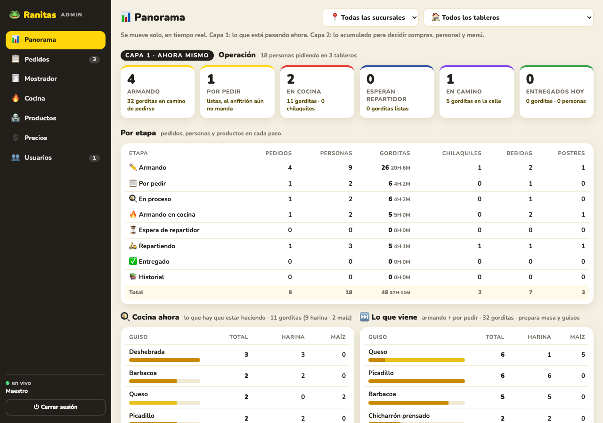
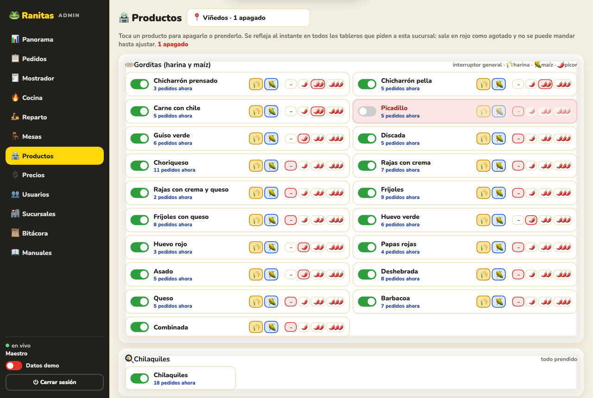
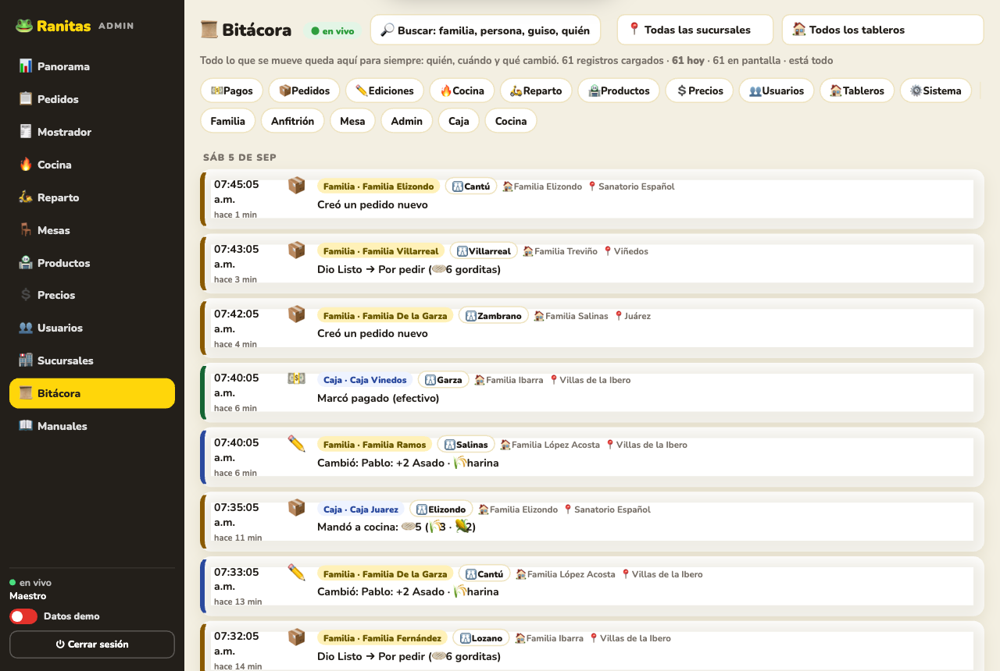

**Modo demo**: el interruptor "Datos demo" abajo a la izquierda llena todas las pantallas de todas las sucursales con datos ficticios que se mueven solos (3.5 s por paso) y nunca tocan Firebase. Sirve para capacitar, grabar videos y enseñar el sistema sin riesgo.

---

## 3. Estructura del repositorio

```
Pedidos_Ranitas/
├── app/                      ← lo que se publica en Cloudflare Pages
│   ├── index.html            ← app de familias (un solo archivo, sin build)
│   ├── admin.html            ← admin del restaurante (un solo archivo)
│   ├── manual.html           ← manuales por perfil
│   ├── mesa.html             ← hoja QR imprimible de una mesa
│   ├── sw.js                 ← service worker (se sirve como /sw)
│   ├── manifest.json         ← PWA familias · admin.json ← PWA admin
│   ├── _redirects            ← /sw → /sw.js · /* → /index.html (rutas SPA)
│   ├── _headers              ← caché: HTML y SW sin caché, PNG un año
│   ├── icon-*.png, admin-icon-*.png, apple-touch-icon*.png, favicon.png, og.png
│   └── manual/*.png          ← capturas de los manuales y de este README
├── sms/                      ← Worker de Cloudflare para SMS al anfitrión (Twilio)
│   ├── worker.js
│   └── wrangler.jsonc
├── deploy.sh                 ← despliegue: sella la versión del SW y publica
├── index.html                ← redirección de la liga vieja de GitHub Pages al dominio
└── README.md
```

Reglas de código: vanilla HTML/JS, cero dependencias de build, Firebase compat SDK 10.12.0 desde CDN, Nunito de Google Fonts, QR con qrcodejs desde cdnjs. Todo el código lleva la firma de autoría de Ricardo López Reyero (RLR · eye · 181218).

---

## 4. Despliegue

```bash
cd ~/Desktop/HTML/Pedidos_Ranitas && ./deploy.sh
```

`deploy.sh` pone la fecha-hora como versión en `app/sw.js` y corre `npx wrangler pages deploy app --project-name ranita --branch main --commit-dirty=true`. **Siempre desplegar con el script**: si la versión del service worker no cambia, las apps instaladas no se actualizan.

Después, subir el código a GitHub (Claude no puede hacer push desde su sesión):

```bash
cd ~/Desktop/HTML/Pedidos_Ranitas && git push
```

- Dominio `ranita.capitaltorreon.com`: CNAME en Cloudflare hacia el proyecto Pages `ranita`.
- **No agregar** una regla `/admin` en `_redirects`: Pages ya sirve `admin.html` como `/admin` y se produce un bucle 308.
- El dominio propio cachea los `.js` cuatro horas en el borde, por eso el service worker se registra como `/sw` (sin extensión).
- La liga vieja de GitHub Pages (`index.html` en la raíz del repo) redirige al dominio nuevo.

### Ver cambios en local

Cualquier servidor estático sobre `app/` sirve (por ejemplo `python3 -m http.server 8141` dentro de `app`). Las rutas bonitas (`/admin`, `/familia-x`) solo funcionan en Pages; en local usa `admin.html?k=123` e `index.html?t=<liga>`.

---

## 5. Datos en Firebase (`ranitas/`)

| Ruta | Contenido |
|---|---|
| `anfitriones/<liga>` | `{nombre, tel, slug, creado, mesa?, mostrador?, sucursal?, numero?, activa?}` |
| `tableros/<liga>/config` | `{sucursal, telIdx, anfitrion, telAnfitrion, direccion, entrega, pago, pagoCon, sms}` |
| `tableros/<liga>/pedidos/<id>` | la tarjeta (abajo) |
| `tableros/<liga>/presence`, `online`, `notif` | quién está viendo, quién teclea, avisos |
| `catalogo/<sucursal>/<cat>_<slug>` | `{on, offH, offM, precio, precioM, ts}` |
| `menu/<cat>_<slug>` | `{pic}` picor de guisos (`g_`) y salsas (`sal_`) |
| `cocina/<sucursal>/cocineros/<id>` | `{nombre, creado}` |
| `reparto/<sucursal>/repartidores/<id>` | `{nombre, creado}` |
| `admin/usuarios/<id>` | `{nombre, clave, vistas[]}` |
| `sucursales/<id>` | `{n, tels[], direccion, activa, orden, creado}` |
| `bitacora/<push>` | registro permanente, solo se agrega |

**La tarjeta** (`pedidos/<id>`):

```
id, familia, estado: armando | porpedir | pedido | entregado | archivado
etapa (solo con estado pedido): proceso | armado | espera | repartiendo | entregado
personas[{id, rol, nombre, masa, gorditas[{guiso, masa, cant, detalle}], chilaquiles{salsa, queso, extras[], guiso, cant}, postres[], bebidas[]}]
notas, sucursal, mesa?, mostrador?
pago{estado, metodo, ts, por}, faltas{lineKey}, avance{lineKey}, empaque{personaId}
cocinero{id, nombre}, repartidor{id, nombre}, viaje, salioEn
creado, actualizado, listoEn, pedidoEn, armadoEn, listoCocinaEn, entregadoEn, archivadoEn, _w (quién escribió)
```

Columnas del admin: **Pedido** = estado `pedido` con etapa `proceso` (ya se pidió, en cola); **En proceso** = etapa `armado` con el comal sin terminar; **Armando en cocina** = etapa `armado` con todo el comal palomeado o el empaque iniciado.

Regla de escritura: nunca se hace `set` de la tarjeta completa salvo al crearla; todo son `update` parciales para que la familia, la caja y la cocina no se pisen. Si la cocina ya tomó un pedido, editarlo pide confirmación.

Las reglas de la base están abiertas (lectura y escritura sin login). Es aceptable para el alcance actual; si el sistema crece, conviene poner reglas por ruta.

---

## 6. PWA: instalar como app

- Dos apps con su ícono: **Ranitas** (familias, rana sobre amarillo) y **Ranitas Admin** (rana sobre oscuro). Íconos 192/512 normales y maskable, ícono de iPhone, capturas y atajos (Pedidos, Mostrador, Cocina, Reparto) en el manifiesto del admin.
- El service worker precarga toda la app: abre al instante desde el ícono y funciona sin señal con lo último guardado. Firebase nunca pasa por él.
- Cuando se despliega una versión nueva, aparece la barra "✨ Hay una versión nueva · Actualizar".
- Píldora "📲 Instalar la app" en Android y computadora; en iPhone explica Compartir → Agregar a pantalla de inicio. Desaparece al instalar y se puede cerrar por una semana.

---

## 7. SMS al anfitrión (pendiente)

`sms/worker.js` manda un SMS al anfitrión cuando una familia nueva entra y cuando da Listo. Ya están puestos los secretos `TWILIO_CLIENT_ID`, `TWILIO_CLIENT_SECRET`, `TWILIO_ACCOUNT_SID` y `TWILIO_FROM` (+1 415 741 1849), pero la app OAuth de Twilio no tiene permiso `messages/create` (error 70051). Dos caminos:

1. Poner el Auth Token clásico: `cd ~/Desktop/HTML/Pedidos_Ranitas/sms && npx wrangler secret put TWILIO_AUTH_TOKEN` (el Worker lo prefiere si existe).
2. O dar permiso de mensajes a la app OAuth en la consola de Twilio.

Probar con:

```bash
curl -X POST https://ranitas-sms.noisy-shape-4fc9.workers.dev/notify -H "Content-Type: application/json" -d '{"slug":"familia-lopez-acosta","cardId":"<id de una tarjeta>","evento":"lista"}'
```

El Worker lee el tablero en Firebase, saca el celular del anfitrión y le manda el texto (`evento` puede ser `nueva` o `lista`). Ricardo dijo que rotará las credenciales que pegó en el chat.

---

## 8. Decisiones de producto que hay que respetar

- **Nunca anteponer "Familia"** ni nada al nombre del pedido: se muestra tal cual lo escribió el cliente.
- **Menú lateral sin contadores**: limpio, solo ícono y nombre.
- **Por turnos**: la tarjeta más antigua arriba, la nueva entra abajo; solo Entregado e Historial van al revés.
- **La mesa va primero** en cocina, con su aviso verde.
- **Reparto es la segunda cocina**: cola propia, viaje con varios pedidos de la misma colonia, entrega parada por parada.
- **Mostrador es el centro de atención al cliente**: atajos a mesas, anfitriones y reparto; al editar un anfitrión se ven todas sus familias y se puede agregar otra. No bloquear por sistema lo que el anfitrión puede hacer desde su celular.
- **En demo ninguna pantalla puede verse vacía**, en ninguna sucursal.
- **Harina y maíz siempre distinguibles**: 🌾 ámbar y 🌽 azul en todos lados.
- **Orden de secciones**: Gorditas → Chilaquiles → Postres → Bebidas.
- Nunca borrar ni editar tarjetas reales al probar; solo tarjetas de prueba propias o el modo demo.

---

## 9. Pendientes conocidos

- Activar el SMS (sección 7).
- Chilaquiles con más opciones de presentación ("ya lo moveremos").
- Mostrar precios a las familias (`config.mostrarPrecios` existe, falta la interfaz).
- Corte diario para Panorama.
- Reglas de seguridad en Firebase si el sistema crece.

---

## 10. Sucursales y catálogo de arranque

| Sucursal | id | WhatsApp |
|---|---|---|
| Sanatorio Español | `sanatorio` | 871 718 9478 · 871 509 3598 |
| Viñedos | `vinedos` | 871 203 6783 · 871 418 9903 |
| Juárez | `juarez` | 871 943 2960 |
| Villas de la Ibero | `ibero` | 871 433 4785 |

Gorditas: Chicharrón prensado, Chicharrón pella, Carne con chile, Picadillo, Guiso verde, Discada, Choriqueso, Rajas con crema, Rajas con crema y queso, Frijoles, Frijoles con queso, Huevo verde, Huevo rojo, Papas rojas, Asado, Deshebrada, Queso, Barbacoa, Combinada. Chilaquiles con salsa (Verde cremosa, Roja, Verde tomatillo, Chipotle con crema, La más picosa), queso (Asadero, Chihuahua) y agregados (Huevo estrellado, Huevo revuelto, Guiso favorito). Postres: Gordita Nutella, Gordita Cajeta, Brownie, Pay. Bebidas: Café de olla, Café de grano, Jugo de naranja, Refresco. Todo se prende, apaga y se le pone precio y picor desde el admin; el catálogo base vive en `CATALOGO` dentro de `admin.html` e `index.html`.

---

Hecho por Ricardo López Reyero con Claude. Código firmado RLR · eye · 181218.
